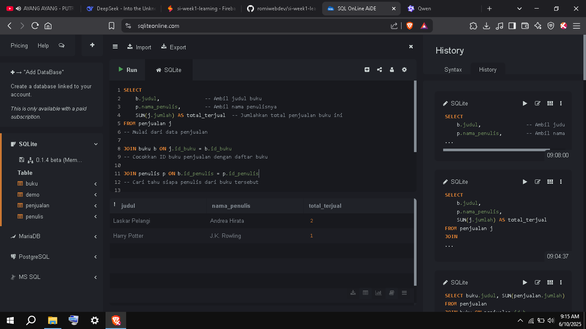

# Portofolio Belajar Sistem Informasi (Minggu 1)

## Hari 1: SQL & Database

### 🔹 Apa yang Dipelajari?
- Membuat tabel dengan **normalisasi (1NF, 2NF, 3NF)**.
- Query dasar: `SELECT`, `JOIN`, `GROUP BY`, `ORDER BY`.
- Studi kasus: Database toko buku.

### 🔹 Cara Menjalankan
1. Buka [SQLiteOnline](https://sqliteonline.com/).
2. Copy query dari file `praktik.sql` atau `tugas.sql`.
3. Paste dan jalankan di SQLiteOnline.

### 🔹 Screenshot Hasil
 